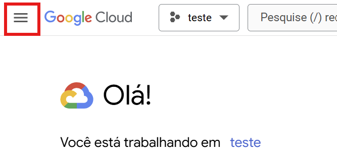
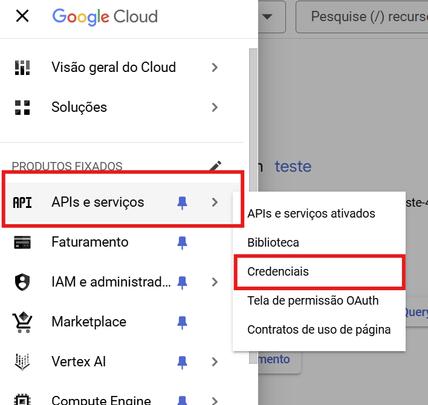
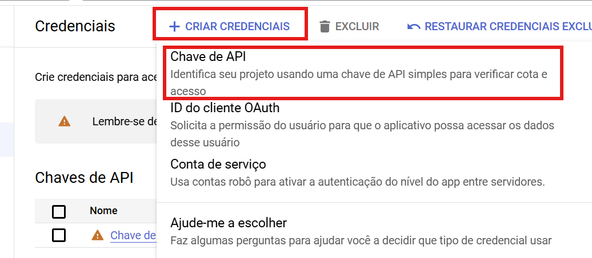

# Sheets-to-csv-with-python
- Processo para usar uma API da google para transformar google sheets para um arquivo csv usando python.

## [Google cloud](https://console.cloud.google.com/welcome?organizationId=0)

1. Criar conta
2. Criar um projeto
3. Habilitar um serviço do google sheets API(Procura na barra de pesquisa)
4. Gerar chave API em APT & Services -> Credencials

